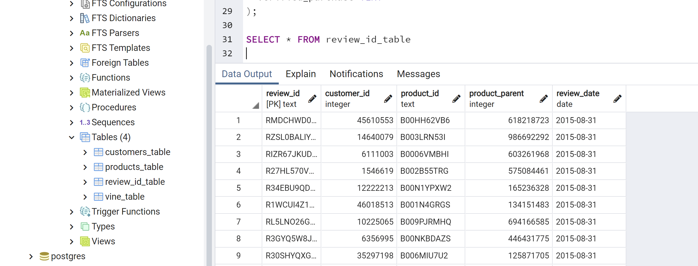

# Amazon_Vine_Analysis

## Overview of the analysis

The purpose of the analysis in this challenge was to evaluate the impact the Vine membership had on reviews of products. A comparison was made between reviews with and without a Vine account to find out if having a Vine account caused a bias toward more favorable reviews. The point is that a Vine member is required to give a review and is doing it as part of an agreement so the question is whether this arrangement impacts the type of review they provide. 

---

## Link to complete code

---

## Results:

All dataframes are available in the link to complete code above. In addion, below are the results:

Images for the PgAdmin tables:

The total number of Vine reviews was: 60. 

The total number of non-Vine reviews was: 14477

### Image of total number of reviews Vine and non-Vine:

The number of Vine 5 star reviews was: 34

The number of non-Vine 5 star reviews was: 8212

### Image of total number of reviews Vine and non-Vine:

Percentage of Vine reviews that were 5 star was: 56.666666666666664

Percentage of Vine reviews that were 5 star was: 56.72445948746287

### Image of total number of reviews Vine and non-Vine:

---

## Summary:

The data was analyzed in the following way: Of the items that had 20 or more votes, the table was filtered to include the rows where the helpful votes accounted for 50% or more of the votes. These two steps ensured that the focus was more on reviews that were considered helpful. 
Then a comparison was made between the paid vs. unpaid reviews. When the paid and unpaid program reviews were compared, there was a very large difference in numbers but no difference in percentage. There was no difference in the percentage of 5 star reviews with or without a Vine account. Both percentage of 5 star reviews were 56%. This is demonstrating that the Vine members did not show a bias toward more favorable reviews. The amount of 5 star reviews was the same as it was for vine and non vine members. 

Further analysis of the data could look into how the rest of the star ratings were spread for Vine vs. non-Vine members and to see if there was any bias in the lower number of stars. 

